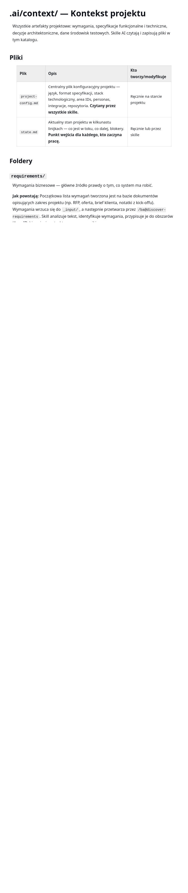

<div align="center">


# Osnova

### Your documentation lives in Git. Your clients never have to know.

**Git-native documentation collaboration between clients and suppliers.**

Markdown and assets stay in your Git repository — the single source of truth. Osnova
wraps that repo in a friendly, permission-aware web layer so clients can **read,
comment on, and (where allowed) edit** the documentation, while every change lands as
a real Git commit. No copy-paste into a second tool that drifts out of date by Friday.

[](LICENSE)
[](https://nextjs.org/)
[](https://react.dev/)
[](https://payloadcms.com/)
[](https://www.postgresql.org/)
[](https://www.keycloak.org/)
[](https://www.anthropic.com/)

[**Features**](docs/features.md) · [**Showcase**](docs/showcase.md) · [**Quick start**](#-quick-start) · [**Docs**](#-documentation)

</div>

---

## Why Osnova

Software teams already keep their backlog, specifications, and documentation as
Markdown in Git. What's missing is a layer that exposes that same git-native material
to the **client** — in a controlled, readable form for review, commenting, and scoped
editing — without forking it into a separate tool that immediately drifts out of sync.

Osnova closes that gap:

- 🗂️ **One source of truth.** Documents are files in a Git repository. Osnova never
  forks content into a parallel database — edits are commits, history is `git log`.
- 🔒 **Controlled client access.** Role-based *views* present a simplified, filtered
  slice of the repo to clients while suppliers keep the full picture. Fail-closed.
- 💬 **Collaboration in context.** Inline and document-level comments, @mentions,
  reactions, approvals, live presence, and notifications — anchored to the living document.
- ✨ **AI that respects your process.** Fold *accepted* review comments into the prose
  with Claude, using curated, workspace-managed skills — never an unsupervised rewrite.
- 🧑‍💻 **No Git knowledge required.** A clean reading experience, a WYSIWYG editor, deep
  links to any paragraph, and history/diff/blame viewers — usable by non-developers.

<div align="center"></div>

## Who it's for

| Role | What they do |
|------|--------------|
| **System Admin** | Creates workspaces, binds Git repositories, manages global access. |
| **Workspace Maintainer** | Supplier lead — manages members, roles, view configuration, AI skills. |
| **Editor** | Supplier analyst / PM / UX — authors and edits content (WYSIWYG or raw Markdown). |
| **Client — Technical** | Architect — reads and comments on specs, ADRs, and infrastructure docs; can approve. |
| **Client — Business** | Product owner — reads a simplified business view, comments, and approves. |
| **Viewer** | Read-only access within the permitted view. |

---

<div align="center">


### Everything below ships today — see the full, illustrated tour in [docs/features.md](docs/features.md).

</div>

## Feature highlights

#### 🔒 Three configurable views with fail-closed RBAC
Each workspace exposes up to three views — **Direct (1:1)**, **Client — Business**, and
**Client — Technical** — with per-view, glob-based include/exclude rules. Client views are
fail-closed (nothing is visible unless explicitly allowed), `.gitignore`/`.gitkeep` are
respected, and document metadata/frontmatter is hidden by default.

 

#### 🗂️ First-class page tree
A real navigation tree with **favorites** (starred, per user), **recently opened**,
expand/collapse-all, live filtering, and lucide iconography — plus deep-linkable URLs and
a `⌘K` command palette.

 

#### ✍️ WYSIWYG + raw Markdown editor
A TipTap-based editor with a formatting toolbar, bubble menu, task lists, and inline
image/attachment upload (drag, paste, or pick — stored alongside the document and committed
to Git). Toggle to raw Markdown anytime. Every save is a commit and push.

<div align="center"></div>

#### 🎀 Office-style ribbon toolbar
Document actions are grouped into a clean ribbon — **Document / Collaboration / Knowledge /
File** — and collapse to a compact icon strip with one click. The preference persists per user.

<div align="center"></div>

#### 💬 Comments, mentions, reactions, approvals — and live presence
Inline comments anchored to selected text, document-level threads, `@mentions`, emoji
reactions, resolve/reopen, and a document review workflow (approve / reject — with an
optional comment posted to the thread — / optional in-review) with stale-revision
detection. **Live presence** shows who else is viewing or editing the
same document right now.

 

#### ✨ AI-assisted comment incorporation
Turn a thread of *accepted* review comments into clean prose — Claude folds them into the
document while you review the diff before anything is committed. Workspace admins curate a
set of reusable **skills** (apply verbatim, unify tone, condense, refine language, restructure)
so reviewers pick an intent instead of writing prompts. Gated by `edit` + `ai-use` permission.

<div align="center"></div>

#### 🕸️ Document dependency graph
See how a document relates to the rest of the repository — a directed graph of cross-references,
laid out by depth, **colour-coded by folder/area** and shaped by doc-type, with 1–3 degrees of
links, pan/zoom, and click-to-open.

<div align="center"></div>

#### 🔀 Guided conflict resolution
When two people edit the same document, Osnova auto-rebases where it can — and when there's a
true conflict, a guided wizard walks you through a side-by-side, hunk-by-hunk resolution instead
of a cryptic Git error.

#### 🕰️ History, diff, blame & one-click restore — straight from Git
Browse every revision of a file, view a rendered preview at any commit, see a unified diff with
line numbers, open per-line blame, and **restore any past version** (even a deleted file) as a
new commit.

<div align="center"></div>

#### 📝 Rich Markdown rendering
GitHub-Flavored Markdown, callouts (`[!NOTE]`, `[!WARNING]`, …), **Mermaid** diagrams,
collapsible blocks, inline images, downloadable attachments, copyable heading anchors, and
**inline PDF embeds** (``).

<div align="center"></div>

#### 🎨 Seven content preview styles
Reading themes independent of the app's light/dark mode — Standard, Reading, Editorial,
Technical, Terminal, Neon, and Pastel — each with its own fonts, colours, spacing, and
column width.

   

#### 🌍 Multi-language (PL / EN / DE)
The whole UI is translated and remembered per user; the Keycloak login screen follows the
chosen language via `ui_locales`; dates are locale-aware.

  

#### 🔔 Notifications inbox + email digest
A notification bell with unread badge, a full inbox with filters and pagination, and an
opt-in daily/weekly email digest of unread activity — plus an audit log of who did what.

<div align="center"></div>

> 📸 **See it all in one place:** the [**Showcase »**](docs/showcase.md) gallery and the
> screenshot-by-screenshot [**Feature guide »**](docs/features.md).

## 🚀 Quick start

> Full instructions: **[docs/getting-started.md](docs/getting-started.md)**.

```bash
# 1. Clone the repository
git clone git@github.com:hycomsa/osnova.git && cd osnova

# 2. Start PostgreSQL (Docker)
docker compose up -d            # postgres:16 on localhost:5433

# 3. Configure environment
cp .env.example .env            # then edit Keycloak + secrets (+ ANTHROPIC_API_KEY for AI)

# 4. Install, seed, run
npm install
npm run seed                    # creates a demo workspace + users
npm run dev                     # http://localhost:3000
```

You'll also need a **Keycloak** realm — see **[docs/keycloak.md](docs/keycloak.md)**.

## 📚 Documentation

| Guide | What's inside |
|-------|---------------|
| [Getting started](docs/getting-started.md) | Prerequisites, install, database, seed, first run. |
| [Configuration](docs/configuration.md) | Every environment variable, view configs, repo bindings, mail, AI. |
| [Keycloak setup](docs/keycloak.md) | Realm, client, redirect URIs, login i18n, troubleshooting. |
| [Features](docs/features.md) | Full, illustrated feature catalogue. |
| [Showcase](docs/showcase.md) | A visual product tour and marketing gallery. |
| [Architecture](docs/architecture.md) | How the pieces fit; data model; access-control model. |
| [Administration](docs/administration.md) | Workspaces, views, roles, repos, AI skills, digests, backups. |
| [Development](docs/development.md) | Project layout, scripts, tests, conventions. |
| [Deployment](docs/deployment.md) | Production build, hardening, scheduling, secrets. |

## 🧱 Tech stack

Next.js 15 (App Router, React 19) · PayloadCMS 3 · PostgreSQL 16 · Keycloak (OIDC) ·
TipTap · remark/rehype · Mermaid · simple-git (git-native worktrees) · Anthropic Claude ·
react-i18next · Tailwind · Vitest · Playwright.

## 🤝 Contributing

Contributions are welcome! Start with **[CONTRIBUTING.md](CONTRIBUTING.md)**, and please
follow our **[Code of Conduct](CODE_OF_CONDUCT.md)**. Changes are tracked in
**[CHANGELOG.md](CHANGELOG.md)**, and CI (typecheck + tests) runs on every pull request.

Found a security issue? Please report it privately — see **[SECURITY.md](SECURITY.md)**.

## 📄 License

Released under the [MIT License](LICENSE). Copyright © 2026 Hycom.
