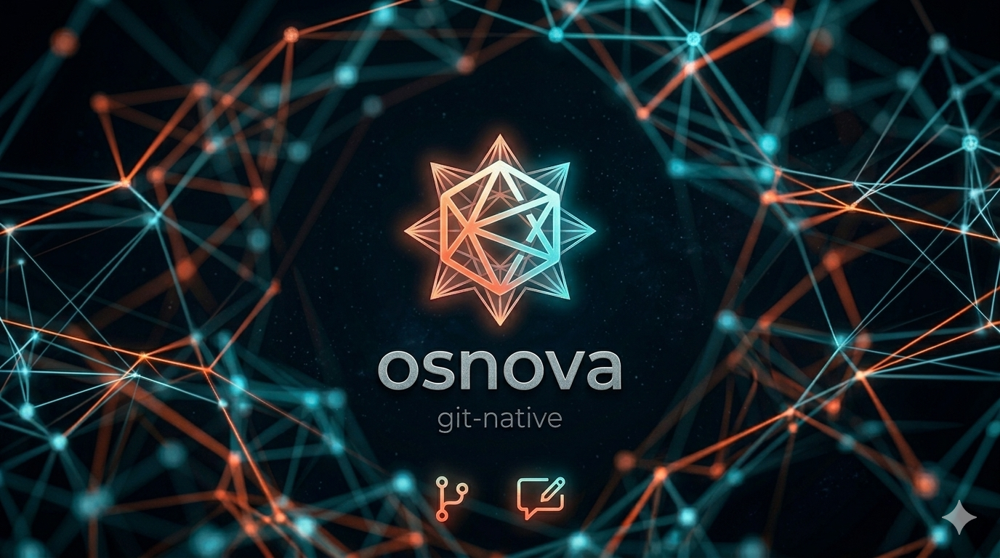
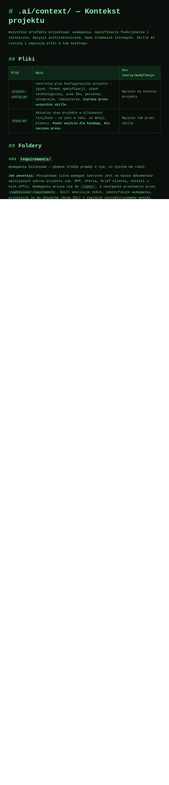
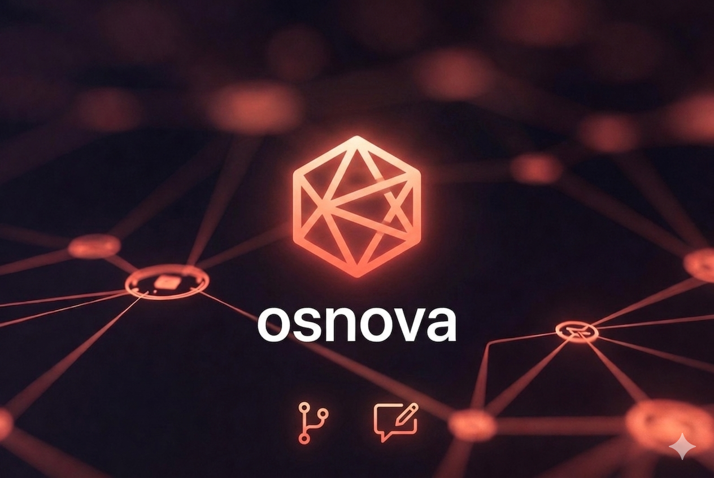
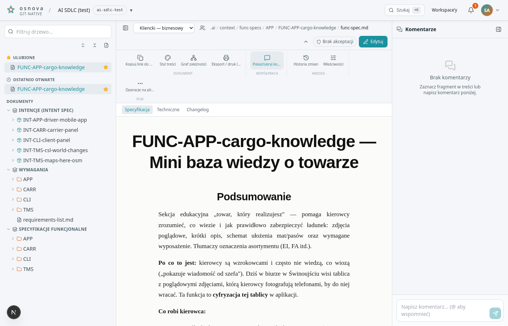
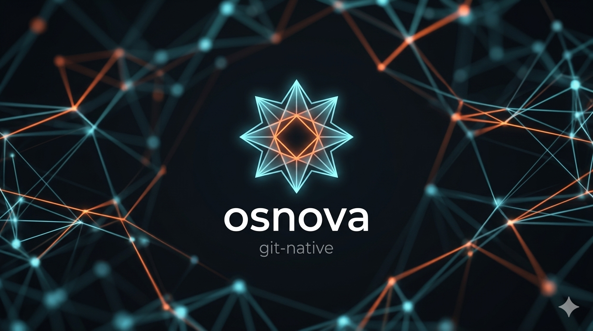
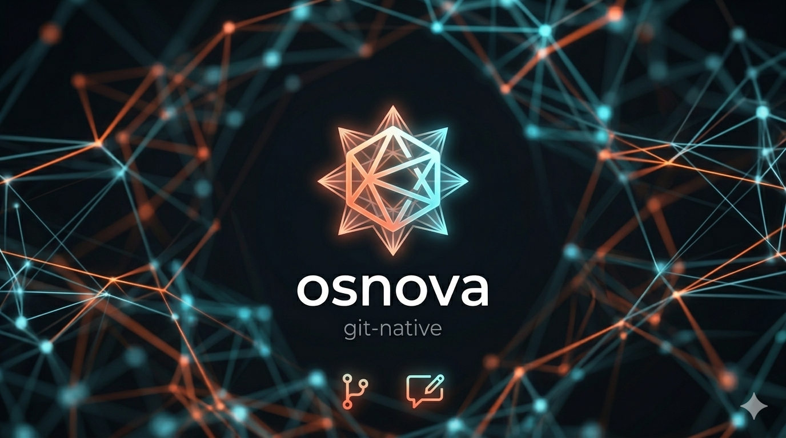

<div align="center">



# Osnova — Product Showcase

**The documentation your suppliers write *is* the documentation your clients read.**
Same files. Same Git history. One controlled, beautiful window onto it.

</div>

---

## The problem, in one sentence

Specs live in Git; clients live in email, slide decks, and stale PDF exports — so the
two drift apart the moment a project starts moving.

## The Osnova answer

A permission-aware web layer **on top of your repository**. Suppliers keep working in
Git; clients get a clean reader, scoped editing, and real collaboration — and every
change is a commit you can `git log`, `git diff`, and `git blame`.

<div align="center"></div>

---

## 1. Controlled access, by design

Up to three **views** per workspace — Direct, Client–Business, Client–Technical — each a
glob-filtered slice of the same repo. Client views are **fail-closed**: nothing shows
unless explicitly allowed. Roles gate every action, server-side.

<div align="center">


</div>

---

## 2. A reading experience clients actually like

A first-class page tree (favorites, recents, `⌘K` palette), seven preview styles, deep
links to any heading, Mermaid diagrams, inline PDFs, and collapsible blocks.

<div align="center">


</div>

<div align="center">



</div>

---

<div align="center">



## 3. Collaboration in context

</div>

Inline and document-level comments, `@mentions`, reactions, and a review workflow
(approve / reject with an optional thread comment / optional in-review) with stale-revision
detection — and **live presence** so you can see who's in the document with you.

<div align="center">


</div>

A tidy, **Office-style ribbon** keeps the actions organized — and collapses to icons when
you want the screen back.

<div align="center"></div>

---

## 4. AI that folds feedback into the doc — with you in control

Mark comments **accepted**, pick a curated **skill** (apply verbatim, unify tone, condense,
refine, restructure), and Claude proposes the rewrite. You review the diff and edit before
it ever becomes a commit. Workspace admins manage the skill set per workspace.

<div align="center"></div>

---

<div align="center">



## 5. Git-native, all the way down

</div>

History, diff, blame, and one-click **restore** come straight from Git. Concurrent edits
get auto-rebased, and true conflicts open a **guided resolution wizard** instead of a
cryptic error.

<div align="center"></div>

And because relationships matter, every document can render a **dependency graph** of its
cross-references — colour-coded by area, shaped by doc-type.

<div align="center"></div>

---

<div align="center">



## Ready in minutes

</div>

```bash
git clone git@github.com:hycomsa/osnova.git && cd osnova
docker compose up -d        # PostgreSQL 16
cp .env.example .env        # Keycloak + secrets
npm install && npm run seed && npm run dev
```

Speaks **Polish, English, and German** out of the box — login screen included.

<div align="center">


</div>

---

<div align="center">

**[← Back to README](../README.md)** · **[Full feature guide →](features.md)** · **[Get started →](getting-started.md)**

Released under the [MIT License](../LICENSE). Copyright © 2026 Hycom.

</div>
